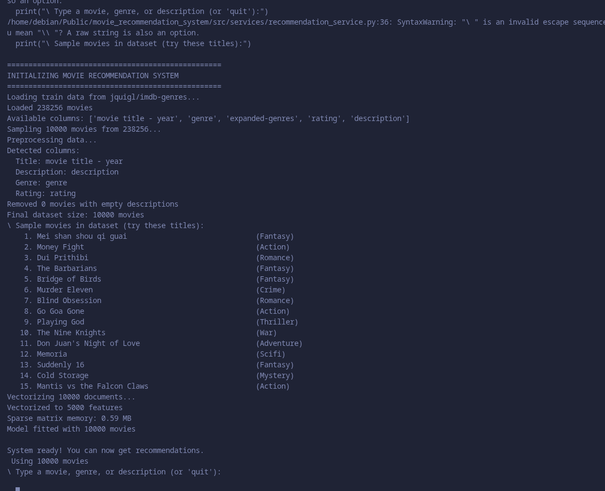
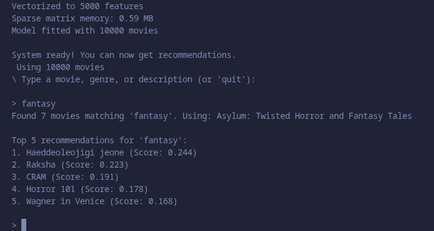
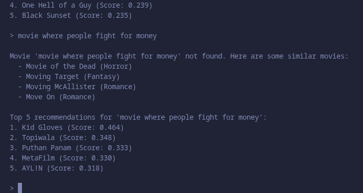

# 🎬 Movie Recommendation System

A content-based movie recommendation system using TF-IDF and cosine similarity.

## 📋 Overview

This system recommends movies based on plot descriptions using:
- **TF-IDF Vectorization** for text feature extraction
- **Cosine Similarity** for finding similar movies
- **NLP Preprocessing** (lowercase, punctuation removal, stopwords, stemming)

## 🚀 Quick Start

### Installation

```bash
git clone https://github.com/yourusername/movie-recommendation-system.git
cd movie-recommendation-system

pip install -r requirements.txt

```

## 📸 Screenshots

**System Initialization**



**Genre Search Results**



**Title Filtering**


**Description Search**

